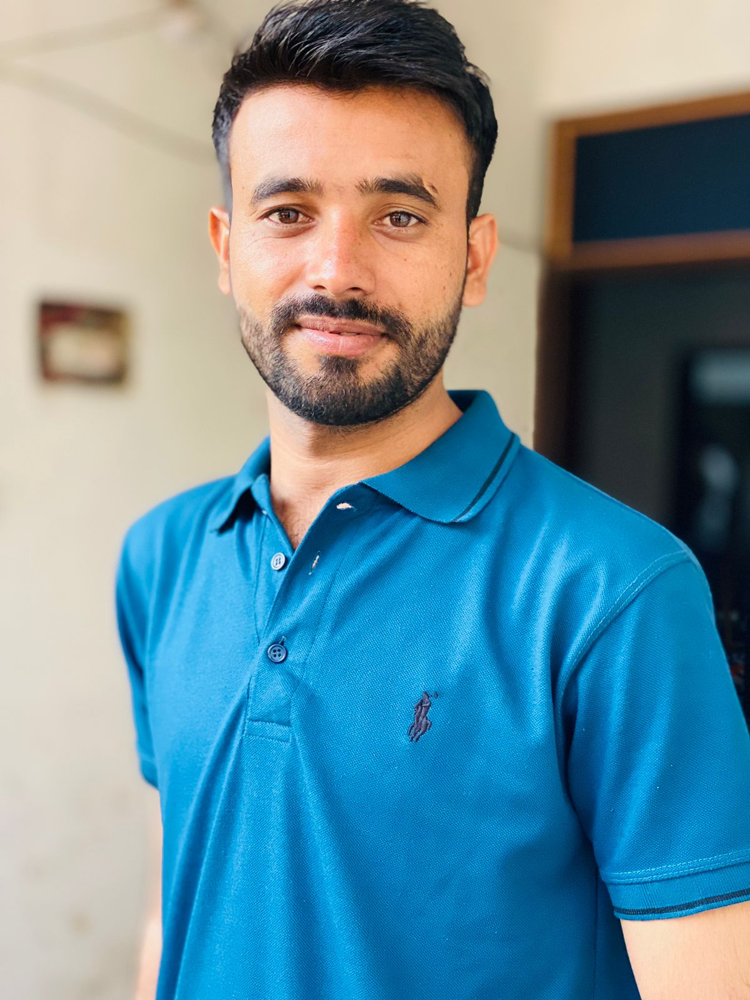

<!DOCTYPE html>
<html lang="en">
<head>
    <meta charset="UTF-8">
    <meta name="viewport" content="width=device-width, initial-scale=1.0">
    <title>Waqar Ali Soomro | Portfolio</title>
    
</head>
<body>
    <!-- Navigation Bar -->
    <header>
        <nav>
            <ul>
                <li><a href="#home">Home</a></li>
                <li><a href="#biography">Biography</a></li>
                <li><a href="#research">Research</a></li>
                <li><a href="#contact">Contact</a></li>
            </ul>
        </nav>
    </header>

    <!-- Home Section -->
    <section id="home">
        
        <h1>Waqar Ali Soomro</h1>
        <h3>Mathematics Enthusiast | Researcher | Aspiring Scholar</h3>
    </section>

    <!-- Biography Section -->
    <section id="biography">
        <h2>📜 Biography</h2>
        
I am <strong>Waqar Ali Soomro</strong>, a passionate mathematics enthusiast.  
        I completed my <strong>Bachelor's in Civil Engineering</strong> but developed a strong interest in mathematics, leading me to pursue a <strong>Master's in Applied Mathematics</strong> at NED University, Karachi, Pakistan.

    </section>

    <!-- Research Section -->
    <section id="research">
        <h2>📊 Research and Projects</h2>
        
<strong>Forecasting using Bayesian VAR Model</strong>

        
<strong>Gaussian Copula</strong>

    </section>

    <!-- Contact Section -->
    <section id="contact">
        <h2>📧 Contact</h2>
        
<strong>Email</strong>: <a href="mailto:waqar.soomro124@gmail.com">waqar.soomro124@gmail.com</a>

        
<strong>LinkedIn</strong>: <a href="#">Your LinkedIn Profile</a>

    </section>

    <!-- Footer -->
    <footer>
        
&copy; 2024 Waqar Ali Soomro | All Rights Reserved

    </footer>
</body>
</html>
