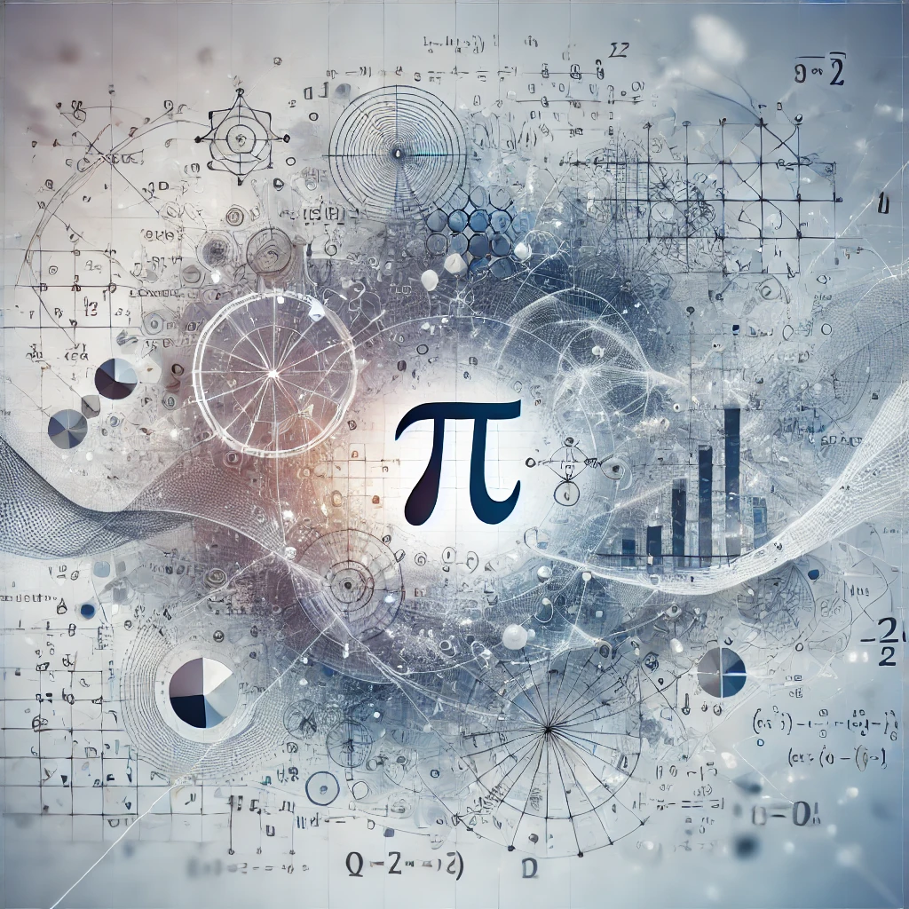

# 🧮 Waqar Ali Soomro 🧮  

    

---

## 📜 Biography  
My first name is **Waqar Ali**, and Soomro is my family name. I am very passionate about **Mathematics**.  
I completed my bachelor's in Civil Engineering, but during my studies, I discovered a deep interest in **Mathematics**.  
This led me to pursue a **Master's in Applied Mathematics** from **NED University, Karachi, Pakistan**.

---

## 📊 Research and Projects
- **Forecasting using Bayesian VAR Model**  
- **Gaussian Copula**  

---

## 🎓 Certifications & Courses  
- **Probability - The Science of Uncertainty and Data** by MIT University (Edx)  
- **Fundamentals of Statistics** by MIT University (Edx)  

---

## 🤖 My Experience in Machine Learning  
In my second semester of **Master's in Applied Mathematics**, I developed a strong foundation in **Machine Learning**, focusing on probabilistic models and mathematical underpinnings.

---

## 📧 Contact  
- **Email**: [waqar.soomro124@gmail.com](mailto:waqar.soomro124@gmail.com)  
- **LinkedIn**: [Your LinkedIn Profile](#)
